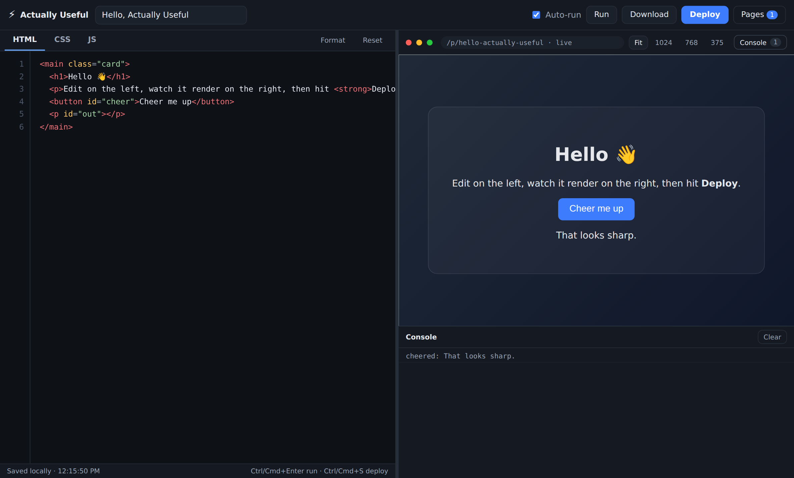

# Actually Useful

An HTML editor with a live preview and one-click page deploy. Write HTML, CSS
and JS in the browser, watch it render as you type, then publish it to a real
URL served by the app itself.

No build step, no npm dependencies — `node server/index.js` and you're editing.



## Run it

```bash
git clone https://github.com/Scipiotoni/Actually-Useful.git
cd Actually-Useful
npm start          # → http://127.0.0.1:3000
```

Requires Node.js 18 or newer. Nothing to install.

Then open **http://127.0.0.1:3000** in your browser — that is the editor. Pages
you deploy from it live at `http://127.0.0.1:3000/p/<name>`.

You *can* open `public/index.html` straight off disk and the editor and preview
will work, but **Deploy** needs the server running, so it is disabled in that
mode and the app tells you so.

## What it does

**Files** — a project holds as many files as you like, in folders if you want.
**＋** asks what kind and what to call it; **Import** takes files or a whole
folder, and dragging them from the desktop works anywhere over the editor.
Tabs switch between them, double-click a tab to rename, × to delete. Refer to
one from another by its plain name: `<a href="about.html">`. Stylesheets and
scripts are linked into every page for you, so you rarely write those tags.

| Kind | Extensions | In the editor |
| --- | --- | --- |
| Markup and code | `.html` `.css` `.js` `.json` `.svg` | Edited, with highlighting |
| Plain text | `.txt` `.md` | Edited, no highlighting |
| Images, icons, fonts | `.png` `.jpg` `.gif` `.webp` `.avif` `.ico` `.woff2` `.woff` | Read-only card with size and a thumbnail |

Binaries are held as base64 and published byte for byte. A project can hold 60
files: 2 MB each for text, 5 MB for binaries.

**Editor** — syntax highlighting that follows the open file's type, line
numbers, the active line marked, and a status bar showing where the caret is.
Native undo, selection and IME all still work, because the editor is a real
`<textarea>` with a highlighted layer painted underneath it.

**Find and replace** — `Ctrl+F` opens it, `Ctrl+H` starts on the replace field.
Every hit is highlighted at once with the current one picked out, `Enter` and
`Shift+Enter` step through them, `Aa` toggles case sensitivity, and *All*
replaces the lot. Whatever you had selected becomes the search term.

**Live preview** — renders into a sandboxed iframe, debounced while you type
(or on demand with Auto-run off). Resize the split, or preview at 1024 / 768 /
375 px to check a layout. `console.log` and uncaught errors from your page are
forwarded to a console panel.

**Deploy** — one click publishes every file in the project to `/p/<slug>/`,
served live by the same server, so `/p/<slug>/about.html` is a real address and
the links between your pages work. Deploying again to the same slug replaces it
and bumps the version; the URL never changes, and a file you removed stops
being served. The **Pages** drawer lists everything you have deployed, and can
reopen any of them back into the editor or delete them.

**Download** — saves the page you are looking at as a standalone `.html` file,
with its stylesheets and scripts folded in so it works on its own.

Your draft is autosaved to `localStorage`, so a reload picks up where you left
off. Once a project passes about 80% of what the browser will store, it says
so while there is still room to act, rather than failing silently later. The preview URL says whether what you see matches what is live
(`· live`) or whether you have `· unpublished changes`.

### Keyboard

The **Shortcuts** button in the status bar lists these in the app. `Ctrl` on
Windows and Linux, `Cmd` on a Mac.

| Shortcut | Action |
| --- | --- |
| `Tab` / `Shift`+`Tab` | Indent / outdent every line the selection touches |
| `Ctrl`+`/` | Comment or uncomment the lines, in the pane's language |
| `Alt`+`↑` / `Alt`+`↓` | Move the lines up or down |
| `Ctrl`+`D` | Duplicate the line, or the selection |
| `Ctrl`+`Shift`+`K` | Delete the line |
| `Home` | Jump to the first character, then to the margin |
| `Ctrl`+`F` / `Ctrl`+`H` | Find / find and replace |
| `Enter` / `Shift`+`Enter` | Next and previous result |
| `Ctrl`+`G` | Go to a line number |
| `Ctrl`+`Enter` | Render the preview now |
| `Ctrl`+`S` | Deploy |
| `Esc` | Close the find bar or any drawer |

### Typing help

In an HTML file, **typing `>` writes the closing tag and leaves the caret
between the two** — `<h1` then `>` gives `<h1>|</h1>`. Attributes come along
(`<div class="card">` closes as `</div>`), elements that never close are left
alone (`<br>`, ``, `<input>` …), and so is anything that is not an opening
tag — `</div>`, `<div />`, or an `a < b` comparison. Typing `</` completes
whichever tag is still open.

Everywhere: Enter keeps the current indent, and adds a level inside a bracket or
between a tag pair. Brackets and quotes close themselves; typing the closer
steps over it instead of doubling it, and backspace between an empty pair
removes both. All of it is one undo step, so `Ctrl+Z` takes back the whole
thing.

**Wrap** in the status bar turns on soft wrapping, which helps on a phone. The
line-number gutter is hidden while it is on, since wrapped lines and a 1:1
gutter cannot both be honest.

### Large files

The editor draws the document twice — the `<textarea>` you type into, and the
coloured layer painted under it — so the cost of a keystroke grows with the
file. Past **80 KB** two things change automatically:

- syntax colouring turns off, and
- only the lines on screen are painted, with the layer still sized to the whole
  document so scrolling, the caret and the line numbers stay put.

The status bar says so when it happens. A file that big is almost always an
image pasted into the HTML as a `data:` URL — upload it under **Images**
instead and the file shrinks back to normal.

Measured on an 800 KB file, this took a keystroke from 480 ms to 70 ms. What
is left is the browser's own cost of editing a very large `<textarea>`, not
anything the editor does on top.

## How files fit together

`public/compose.js` decides what each file is served as, and it is the *same*
module the browser uses for the preview and the server uses for the deploy — so
what you preview is what gets published.

One rule covers it: **write a fragment and it gets wired up for you; write a
full document and you are in charge.**

- An HTML file that is a *fragment* (no `<html>` tag) is wrapped in a page
  skeleton, with every stylesheet and script in the project linked into it.
- An HTML file that is a *complete document* is published exactly as written.
  Nothing is added, so its own `<link>` and `<script>` tags decide what loads.
- CSS and JS files are published as they are.

Links between files are plain relative names, which is why a deploy lives at
`/p/<slug>/` with the trailing slash — `about.html` in a page has to resolve to
its sibling, here and on GitHub Pages alike. Requests to `/p/<slug>` are
redirected so that holds either way. Images use `../assets/<name>` for the same
reason, and the app serves them at `/p/assets/<name>` to mirror the layout
GitHub Pages has.

While you are drafting, nothing is served yet, so the preview folds the
project's own stylesheets and scripts into the page, points every other
reference — images, icons, fonts, and `url()` inside a stylesheet — at an
inline `data:` URL, and switches page when you follow a link between them.

Those have to be `data:` URLs rather than `blob:` ones. The preview is
sandboxed without `allow-same-origin`, which is what stops a page you are
writing from reaching into the editor around it; a frame with an opaque origin
like that cannot read a blob URL minted outside it, while a `data:` URL carries
its own bytes.

The original three-pane shape (`{html, css, js}`) is still accepted by the API
and still loads, arriving as `index.html`, `styles.css` and `app.js`.

## HTTP API

The UI is just a client of this API.

| Method | Path | Purpose |
| --- | --- | --- |
| `GET` | `/api/deploys` | List deployed pages, newest first (includes source) |
| `POST` | `/api/deploys` | Deploy. Body: `{name, slug?, files: [{name, content}]}` |
| `GET` | `/api/deploys/:slug` | Fetch one page and its source |
| `DELETE` | `/api/deploys/:slug` | Remove a deployed page |
| `GET` | `/p/:slug/` | The deploy's entry page |
| `GET` | `/p/:slug/:file` | Any file in the deploy |
| `GET` | `/api/assets` | List uploaded images |
| `POST` | `/api/assets` | Upload. Body: `{name, data}` where data is a data: URL |
| `DELETE` | `/api/assets/:name` | Remove an image |
| `GET` | `/assets/:name` | The image itself (public) |

Omit `slug` on `POST` to create a new page — the slug is derived from the name
and de-duplicated (`my-page`, `my-page-2`, …). Pass `slug` to overwrite that
page in place.

```bash
curl -X POST localhost:3000/api/deploys \
  -H 'content-type: application/json' \
  -d '{"name":"From curl","files":[
        {"name":"index.html","content":"<h1>hi</h1><a href=\"two.html\">two</a>"},
        {"name":"two.html","content":"<h1>page two</h1>"},
        {"name":"styles.css","content":"h1{color:rebeccapurple}"}]}'
# {"slug":"from-curl", ... ,"url":"http://localhost:3000/p/from-curl/"}
```

A project holds up to 40 files, each up to 2 MB. Names must end in `.html`,
`.css` or `.js`, and at least one `.html` file is required.

## Progressive web apps

Because every file lands at the path shown in the panel, a project with
`index.html`, `sw.js`, `manifest.json` and `icons/icon-192.png` deploys as a
working PWA — the service worker sits beside the page it controls.

One thing to know: a deploy lives in its own folder (`/p/<slug>/`, and
`/published/<slug>/` on GitHub Pages) so that you can keep several projects.
A service worker only controls its own folder downwards, so set the manifest's
`scope` and `start_url` to `.` and the app works from there. It cannot claim
the whole site unless one project owns the whole repository.

The preview cannot register a service worker at all — it runs in a sandboxed
frame with no origin of its own — so `navigator.serviceWorker.register` is
answered with a note in the console panel instead of throwing.

## Images

The **Images** drawer takes uploads by button or drag-and-drop and stores them
next to your pages. Each one reports a path like `../assets/my-photo.png`,
which you drop into an `` — *Insert* puts the whole tag in your
HTML for you.

That path is relative on purpose, because a published page is served from two
places and both have to work:

```
the app          /p/<slug>                     → ../assets/x.png = /assets/x.png
GitHub Pages     /published/<slug>/index.html  → ../assets/x.png = /published/assets/x.png
```

The live preview gets a matching `<base>`, so what you see while editing is what
the published page shows.

PNG, JPEG, GIF, WebP, AVIF and SVG are accepted, up to 5 MB each. Uploads are
identified by their actual bytes rather than by filename, so renaming something
to `.png` will not get it in. SVG is served with a `sandbox` CSP, since an SVG
can carry script and would otherwise run on the editor's own origin.

Images live in `published/assets/` in the repository (GitHub storage) or
`_assets/` beside the pages (disk storage), and they are public, like the pages
that embed them.

## Password protection

Set `AU_PASSWORD` and the editor asks for it:

```bash
AU_PASSWORD="something long and private" npm start
```

**Published pages stay public** — that is the point of publishing them. Only the
editor and the write API are locked, so you can share a `/p/<slug>` link with
anyone while nobody else can deploy, overwrite or delete your pages.

Signing in sets a signed, `HttpOnly`, 7-day cookie. Wrong guesses are throttled
per IP, with the lockout growing after five failures.

With no `AU_PASSWORD` set the app runs open, which is the sensible default on
`127.0.0.1`. Because that is *not* sensible on a public address, the server
**refuses to start** if `HOST` is non-loopback and no password is set. Override
with `AU_ALLOW_PUBLIC_WRITES=1` if you really mean it.

## Configuration

| Variable | Default | Meaning |
| --- | --- | --- |
| `PORT` | `3000` | Port to listen on |
| `HOST` | `127.0.0.1` | Bind address — set to `0.0.0.0` to expose it |
| `AU_PASSWORD` | *(unset)* | Password for the editor. Unset means no login |
| `AU_DATA_DIR` | `./data/sites` | Where deployed pages are stored on disk |
| `AU_GITHUB_TOKEN` | *(unset)* | Fine-grained token; enables GitHub storage |
| `AU_GITHUB_REPO` | *(unset)* | `owner/repo` to store published pages in |
| `AU_GITHUB_BRANCH` | *(repo default)* | Branch to commit pages to |
| `AU_ALLOW_PUBLIC_WRITES` | *(unset)* | Permit a public bind with no password |

## Open it on your phone

On the same Wi-Fi, bind to every interface and set a password (the server
refuses a non-loopback bind without one):

```bash
AU_PASSWORD="a password" HOST=0.0.0.0 npm start
```

It prints the address to type on the other device:

```
Actually Useful is running. Open one of these:
  On this computer   http://127.0.0.1:3000
  On the same Wi-Fi  http://192.168.1.42:3000
```

Both devices must be on the same network, and your firewall has to allow the
port. This does not reach beyond the local network — for that, publish it.

## Never lose a published page

By default pages are written to `data/sites/` on local disk. On a host with an
ephemeral filesystem — Render's free plan among them — that disk is wiped on
every restart, taking the published pages with it.

Point the app at a GitHub repository instead and they stop being erasable:

```bash
AU_GITHUB_TOKEN="github_pat_..." AU_GITHUB_REPO="owner/repo" npm start
```

Each publish becomes one commit writing three files:

```
published/index.json          the list of pages
published/<slug>/page.json    metadata and the three editor panes
published/<slug>/index.html   the composed page
```

So you also get a full history: every version of every page is a commit you can
read or restore. Everything is cached in memory after the first read, so serving
a page costs no API calls.

Turn on **GitHub Pages** for the repository and those pages are served straight
from GitHub, permanently and without a cold start, at
`https://<owner>.github.io/<repo>/published/<slug>/`. The app reports that
address as `permanentUrl` and the editor links to it. GitHub Pages rebuilds
[about ten times an hour](https://docs.github.com/en/pages/getting-started-with-github-pages/github-pages-limits),
so publishing in a tight loop makes the last few appear late — nothing is lost.

The token should be a **fine-grained** personal access token, scoped to that one
repository, with **Contents: read and write** and nothing else. Note that pages
published this way are stored in the repository, so on a public repo they are
publicly readable — which is what publishing means, but worth knowing.

## Put it on the internet

`render.yaml` is a ready Render Blueprint: **New → Blueprint**, point it at this
repository, set `AU_PASSWORD` when prompted.

**Know this before you rely on it.** Render's free plan gives every service an
[ephemeral filesystem](https://render.com/docs/disks) and
[spins it down after 15 minutes without traffic](https://render.com/docs/free).
Deployed pages live on that filesystem, so **they are erased on every spin-down
and redeploy**. Your editor draft is kept in the browser, so nothing you were
writing is lost — but the published URLs go 404 until you press Deploy again.

To keep pages permanently you need a paid instance type with a persistent disk
(disks cannot be attached to free services). `render.yaml` has the lines to
uncomment.

Any host that runs Node works the same way: it needs `HOST=0.0.0.0`, whatever
`PORT` the platform provides, and `AU_PASSWORD`.

Each deploy is a directory holding the rendered `index.html` and a `meta.json`
with the original panes, so nothing is locked inside the app.

## Tests

```bash
npm test
```

Covers deploy/redeploy/versioning, slug collisions, listing and deletion, path
traversal (including percent-encoded attempts) and payload limits, the password
gate, image upload and serving, GitHub storage against a stand-in API, the
compose rules (fragment wrapping, full-document injection, `</script>`
escaping), and every editing command — indent, comment, move, duplicate,
delete and find — as pure functions over text and a selection, so their edge
cases (blank lines, the last line, no trailing newline) are pinned down without
needing a browser.

## Security notes

The default bind address is loopback, and this is built as a local tool for
pages you write yourself. Two things to know before exposing it:

- **The API is unauthenticated.** Anyone who can reach the port can deploy,
  overwrite or delete pages. Put it behind a reverse proxy with auth if it
  needs to be public.
- **Deployed pages run on the app's own origin.** A page you deploy can script
  against `/api/deploys`. Only deploy code you trust — which, since you wrote
  it in the editor, is normally the point.

Slugs are validated against `^[a-z0-9][a-z0-9-]{0,59}$` and resolved paths are
checked against the data root, so a slug cannot escape it. Request bodies are
capped at 8 MB and each pane at 2 MB.

## Layout

```
server/index.js    HTTP server: static files, JSON API, /p/<slug> hosting
server/store.js    File-backed deploy storage, slugging and validation
server/github-store.js  The same, backed by commits to a GitHub repository
server/auth.js     Optional password gate: cookies, throttling, login page
server/assets.js   Image validation: format sniffing, naming, size limits
public/compose.js  What each file is served as (shared by client and server)
public/editor.js   MiniEditor: highlighting, find, and the editing commands
public/app.js      Editor wiring: tabs, preview, console, deploy, drawer
public/styles.css  Everything visual
test/api.test.js   node:test suite over the API, auth and compose rules
test/editor.test.js        The editor's text operations, as pure functions
test/github-store.test.js  GitHub storage, against a stand-in GitHub API
```

## License

MIT
